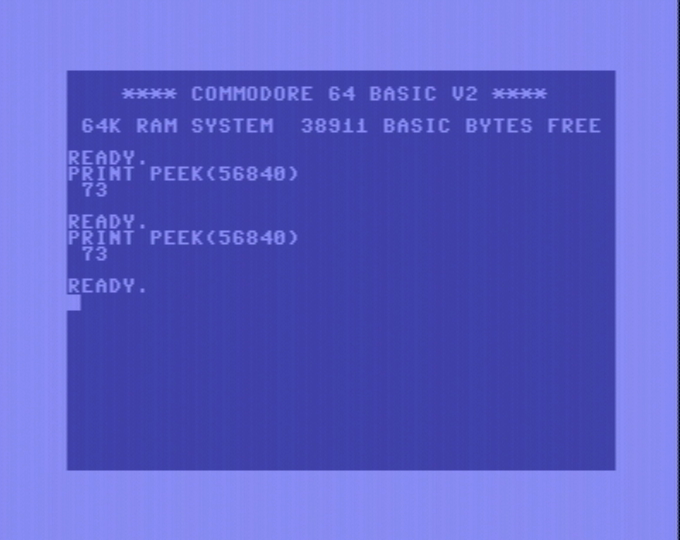
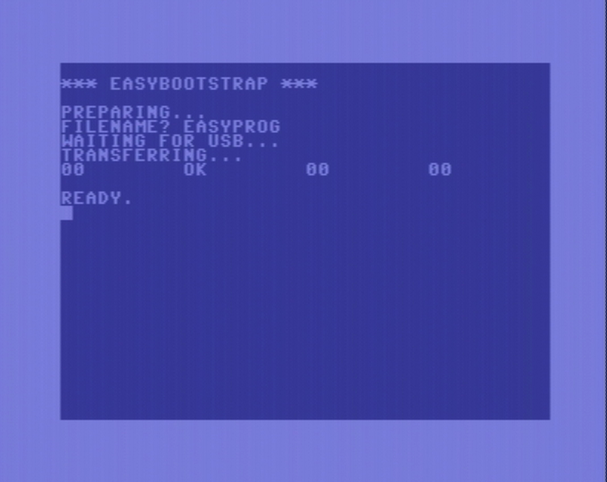

# EasyBootstrap

## Introduction

This is EasyBootstrap, a minimal BASIC tool to transfer a program
file from PC to a Commodore 64/128 disk drive. Wait, there is nothing
to download here: It's a program you must enter using your keybord, see
below.

## Repository and Issue Tracker

The official repository and issue tracker is located at 
https://gitlab.com/easyflash/easybootstrap/.

Look at https://gitlab.com/easyflash/ for other EasyFlash related repositories.

A mirror of the source repository can be found at
https://github.com/easyflash-mirror/easybootstrap/.

## License

(C) Thomas 'skoe' Giesel

Refer to [LICENSE.md](./LICENSE.md).

## Usage

Sometimes you have your Commodore 64 with a disk drive, a freshly built EasyFlash 3,
possibly without any or just ancient software on it and a PC. But no means to get
data to your C64 and thus no chance to get it all running.

This is when EasyBootstrap comes into play.

It is a small BASIC program you can enter into your Commodore 64, save it to disk (just as a backup, you don't want to enter it twice).It can use a bare USB connection to transfer a program: 

PC ➡️ USB ➡️ EasyFlash 3 ➡️ Commodore 64 ➡️ Disk Drive

The only thing it needs is an EasyFlash 3 (works even without software on it) and a correctly inititalized CPLD and FTDI-Chip.

Use it to copy the latest EasyProg to a disk, which will be the starting point to initialize the rest.

These are the steps needed:

1.  Make sure you have the latest CPLD core. If in doubt, update 
    it by following the guide on the bottom part of that page:
    https://skoe.de/easyflash/ef3update/. Make sure to put the jumpers
    back to the *DATA* position.
2.  Use the *SPECIAL* button to enter BASIC. Don't worry if your
    Commodore 64 screen remains black or shows garbage if there is no
    software on the EasyFlash 3, the *SPECIAL* button will work if the
    CPLD is configured correctly.
3.  You can check whether your EasyFlash 3 is active with the command shown
    in the following screenshot. It must always print the encoded version
    number of the CPLD, for 1.1.1 it must show `73`
    (73 = $49 = 01.001.001 = 1.1.1).
    Try it several times, the number must not change.

    

4.  Enter the listing of EasyBootstrap exactly as shown below. 
    Double-check everything.
5.  Save it to disk:
   
    `SAVE"EASYBOOTSTRAP",8`

    Remember that Commodore 64 drives do not overwrite files by default.
    If you need to replace a file, either delete it before saving or chose
    another name.
6.  Download [EasyTransfer](https://skoe.de/easyflash/downloads/) and the 
    program you want to transfer, e.g.,
    [EasyProg](https://skoe.de/easyflash/downloads/).
7.  Make sure there is a disk in your drive with enough space for the
    program. Run *EasyBootstrap* on your Commodore 64 and enter a file
    name for the program to be transfered.
8.  Connect the USB cable and send the file from the PC using 
    *EasyTransfer* as described
    [there](https://skoe.de/easyflash/usbfiletransfer/) in section
    *Starting single-load programs with EasyTransfer*. Yes, it will not
    be started, but written to disk. You must use the "Start PRG" tab 
    nevertheless.
    
    * Alternatively you can use the command line program
      `ef3xfer -x foo.prg`.
 
9.  If the EasyTransfer reports success and the Commodore 64 side
    looks like in the image below, everything worked fine.

    

10. Yay! Now you can load the new program from disk as usual.
    With this, e.g., you can
    [update or initialize your EasyFlash 3 menu](https://skoe.de/easyflash/ef3update/).


## The Source Code

```
1 PRINT:PRINT"*** EASYBOOTSTRAP ***"
2 PRINT:PRINT"PREPARING..."
3 D=8
4 GOTO 10
5 V=ASC(E$):E$=MID$(E$,2)
6 IF V=32 GOTO 5
7 V=V-55:IF V<3 THEN V=V+7
8 RETURN
10 S=49152:K=S
11 READ N,CS,E$
12 FOR I=1 TO N
13 IF E$="" THEN READ E$
14 GOSUB5:A=V*16
15 GOSUB5:A=A+V
16 A=A AND 255:POKE S,A:S=S+1
17 CS=CS-A:NEXT
18 IF CS THEN PRINT "TYPO?":END
20 PRINT"FILENAME";:INPUT F$
21 OPEN 1,D,1,F$
22 IF ST THEN PRINT"FAILED TO OPEN FILE":GOTO 40
30 PRINT"WAITING FOR USB..."
31 SYS K
32 PRINT"TRANSFERRING..."
33 SYS K+3
40 CLOSE 1
41 OPEN 1,D,15
42 INPUT#1,A$,B$,C$,D$
43 PRINT A$,B$,C$,D$
44 CLOSE 1
50 DATA 146,18202
51 DATA "4C53C0 A20120 C9FF20 41C0A9"
52 DATA "FF2080 C02080 C02089 C0AA20"
53 DATA "89C0A8 CAE0FF D00588 C0FFF0"
54 DATA "0E20B7 FFD011 2089C0 20D2FF"
55 DATA "4C1BC0 A90020 80C020 80C085"
56 DATA "024CCC FF60A0 04B94E C02080"
57 DATA "C08830 F410F5 004441 4F4CA2"
58 DATA "00BD01 C49D00 C4E8E0 0BD0F5"
59 DATA "2089C0 8D0BC4 A20BBD 00C4DD"
60 DATA "74C0D0 E3CA10 F56045 465354"
61 DATA "415254 3A5052 47002C 09DE50"
62 DATA "FB8D0A DE602C 09DE10 FBAD0A"
63 DATA "DE60"

```

## Build Dependencies

This section is only relevant for developers, not for users.

The output file of this project is this `README.md`. To build it,
the following is needed:

- Bash
- Python 3
- Vice emulator for `petcat`
- ACME assembler

Just run `./build.sh`

